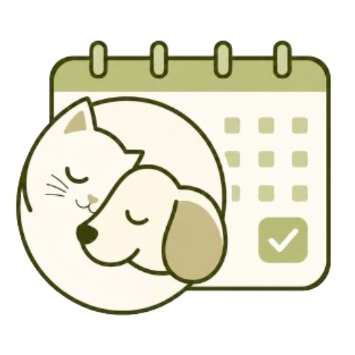

 

  

 
 <h1 align="center"> 🐾 AGENDAPETS - RESERVAS PETGROOMING🐶</h1>

---

## 🚀 Deploys

  

  

## 🚧 Proyecto en construcción 🚧
Plataforma web enfocada en la gestión de reservas para servicios de **pet grooming**, diseñada para optimizar procesos, mejorar la experiencia del usuario y garantizar el bienestar de las mascotas.

---

## 🎯 Propósito
- Desarrollar una solución digital que facilite la organización de citas  
- Permitir a negocios de pet grooming gestionar servicios de forma eficiente  
- Mejorar la experiencia tanto del cliente como del negocio  

---

## 🌎 Visión & Misión (Resumen)
- Ser una plataforma líder en Colombia  
- Simplificar la gestión de reservas  
- Ofrecer una experiencia clara, accesible y centrada en el cuidado de las mascotas  

---

## ⚙️ Funcionalidades (En desarrollo)
- 📅 Sistema de reservas online  
- 🐕 Gestión de servicios para mascotas  
- 👤 Registro de clientes  
- 📊 Organización del negocio  

### 🔮 Futuro
- Historial de servicios  
- Seguimiento de mascotas  
- Personalización de la experiencia  

---

## 👩‍💻 Equipo de Desarrollo (Bootcamp Generation)
- Juan Carlos Pastas  
- Carol Piñeros  
- Diego Rojas  
- Juan Camilo Acevedo  
- Valeria Díaz  

---

## 🚀 Estado del proyecto
🟡 En desarrollo activo